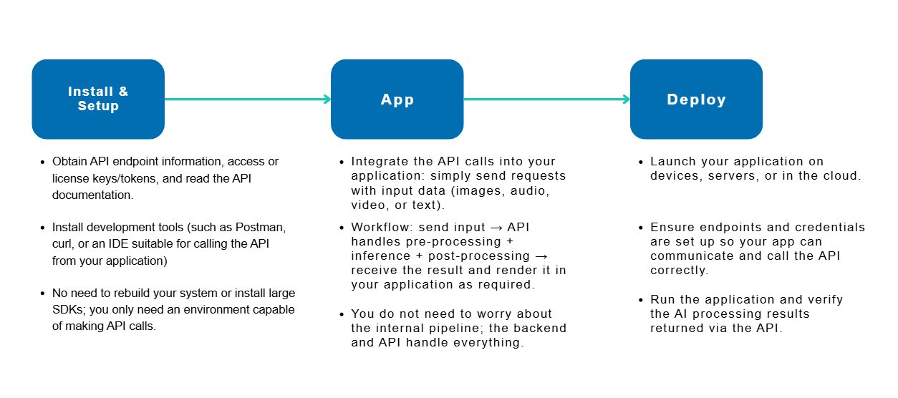

# EDGE AI Workflow

The new Edge AI Workflow architecture is designed to accelerate AI application development for edge platforms and accelerator cards, focusing on simplicity, efficiency, and integration via APIs. This modern workflow divides the process into practical stages, making it easy for developers to get started and deploy robust AI solutions with minimal friction.



# AI System (Updating)
| Vendor | Device |  SOC | Edge AI Workflow | Model Conversion & Optimization | Deploy Application |
| -------- | -------- | -------- | ---- | ---- | ---- |
| Qualcomm | DK2721  | QCS6490 | [How-To](ai_system/qualcomm/dk2721/README.md) | [Convert & Optimize](ai_system/qualcomm/dk2721/object_detection_demo-using-qc_snpe.md#Open_AI_Model) | [App Guide](ai_system/qualcomm/dk2721/object_detection_demo-using-qc_snpe.md#Application) |
| Intel | R360    | Core Ultra | [How-To](ai_system/intel/r360/README.md)  | [Convert & Optimize](ai_system/intel/r360/object_detection_demo-using-intel_openvino.md#Covert_Optimize) |[App Guide](ai_system/intel/r360/object_detection_demo-using-intel_openvino.md#Deploy) |
| NVIDIA | 030     | Jetson AGX Orin | [How-To](ai_system/jetson/030/README.md)  | [Convert & Optimize](ai_system/jetson/030/object_detection_demo-using-ds7.0.md#convert-ai-model) |[App Guide](ai_system/jetson/030/object_detection_demo-using-ds7.0.md#application) |
| NVIDIA | R7300   | Jetson Orin Nano   | [How-To](ai_system/jetson/r7300/README.md)  | [Convert & Optimize](ai_system/jetson/r7300/object_detection_demo-using-ds7.1.md#convert-ai-model) | [App Guide](ai_system/jetson/r7300/object_detection_demo-using-ds7.1.md#application) |
| AMD | 2210   | Ryzen 8000 Series | [How-To](ai_system/amd/2210/README.md)  | [Convert & Optimize](ai_system/amd/2210/object_detection_demo-using-amd_ryzenaisdk.md#download-ai-files) | [App Guide](ai_system/amd/2210/object_detection_demo-using-amd_ryzenaisdk.md#application) |

# AI Accelerator (Updating)
| Vendor | Model |  SOC | AI Workflow | Model Conversion & Optimization | Deploy Application |
| -------- | -------- | -------- | ---- | ---- | ---- |
| Hailo | 1200 <br/> EAI-3300   | Hailo-8 | [How-To](ai_accelerator/hailo/1200_3300/README.md) | [Convert & Optimize](ai_accelerator/hailo/1200_3300/object_detection_demo-using-hailo.md#Model) | [App Guide](ai_accelerator/hailo/1200_3300/object_detection_demo-using-hailo.md#App) |
| Rockchip | OPI5-Plus  | RK3588 | [How-To](ai_system/rockchip/opi5-plus/README.md) | [Convert & Optimize](ai_system/rockchip/opi5-plus/object_detection_demo-using-rknpu.md#convert-ai-model) | [App Guide](ai_system/rockchip/opi5-plus/object_detection_demo-using-rknpu.md#application) |

# Hệ thống REST Instance

Kho mã này mô tả cách phơi bày CVEDIX Edge AI SDK thông qua một control plane RESTful.  
Mục tiêu là giúp backend dịch vụ hoặc người vận hành từ xa có thể cấu hình, khởi chạy và giám sát
các instance thị giác máy tính thời gian thực trên thiết bị biên mà không cần truy cập trực tiếp.

## Tổng quan hệ thống

1. **Client RESTful API Backend**  
   Backend sản phẩm hoặc cổng vận hành gửi các lệnh REST để điều khiển instance trên thiết bị biên.
2. **RESTful API Backend (Edge node)**  
   Dịch vụ HTTP nhẹ chạy cùng SDK, chuyển đổi request thành hành động trên instance.
3. **instance Manager**  
   Quản lý vòng đời node, kiểm tra đồ thị kết nối và lưu trữ cấu hình instance.
4. **Các khối AI Node**  
   Tập hợp node CVEDIX (nguồn, suy luận, tracker, phân tích hành vi, OSD...) xử lý luồng dữ liệu thời gian thực.
5. **Data Broker**  
   Trung chuyển metadata khung hình và sự kiện giữa các node, đồng thời công bố phân tích cho hệ thống thượng tầng.
6. **Output Display Nodes**  
   Xuất ra màn hình cục bộ, đẩy RTMP/RTSP hoặc ghi file tùy nhu cầu triển khai.

### Chu trình vòng đời

1. **Create**: API kiểm tra schema, lưu đồ thị và cấp ID.
2. **Start**: instance Manager khởi tạo node qua Edge AI SDK và kết nối phụ thuộc.
3. **Monitor**: Data Broker phát số liệu (kèm luồng WebSocket nếu bật).
4. **Stop**: instance Manager tháo node, xả buffer và lưu bộ đếm.

## Lưu ý triển khai

- Đóng gói REST API và SDK trong container hoặc dịch vụ systemd.
- Sử dụng lưu trữ bền vững cho cấu hình instance và mô hình AI (`/opt/cvedix_data`).
- Giám sát mức sử dụng CPU/GPU, lập kế hoạch tài nguyên cho từng node (source/infer/tracker/BA).
- Bảo vệ REST API bằng mTLS hoặc token, đồng thời ghi log mọi thay đổi instance.

## Lộ trình phát triển

- Bổ sung RBAC đa tenant để kiểm soát truy cập theo instance.
- Hiện thực luồng sự kiện WebSocket cho cảnh báo thời gian thực.
- Hỗ trợ thay nóng mô hình và chỉnh ROI tức thời.
- Tích hợp cơ sở dữ liệu chuỗi thời gian (InfluxDB, Prometheus) cho phân tích dài hạn.

---

Để xem chi tiết giao diện các node của CVEDIX SDK, tham khảo tài liệu của nhà cung cấp hoặc các
header dưới `/usr/include/cvedix`. Bạn có thể mở rộng ví dụ này với đồ thị node riêng, dashboard,
hoặc script tự động triển khai.

---

## 🚀 Triển Khai Lên Thiết Bị Thật (Production)

### Setup Tự Động (Khuyến Nghị)

Để setup project từ đầu đến cuối, sử dụng script `setup.sh`:

```bash
# Development setup (không cần sudo)
./setup.sh

# Production setup (cần sudo)
sudo ./setup.sh --production
```

Script này sẽ tự động:
- ✅ Kiểm tra prerequisites và cài đặt dependencies
- ✅ Build project với CMake
- ✅ Tạo user và thư mục cần thiết (production mode)
- ✅ Cài đặt executable vào hệ thống (production mode)
- ✅ Cài đặt systemd service (production mode)
- ✅ Kích hoạt tự động chạy khi khởi động (production mode)
- ✅ Khởi động service ngay lập tức (production mode)

**Xem chi tiết:** [docs/DEVELOPMENT_SETUP.md](docs/DEVELOPMENT_SETUP.md) - Hướng dẫn setup đầy đủ

### Tự Động Chạy Khi Khởi Động Thiết Bị (Cách Cũ)

Nếu muốn sử dụng script triển khai cũ:

```bash
cd /home/ubuntu/project/edge_ai_api
sudo ./deploy/build.sh
```

### Kiểm Tra Service

```bash
# Xem trạng thái
sudo systemctl status edge-ai-api

# Xem log
sudo journalctl -u edge-ai-api -f

# Test API
curl http://localhost:8080/v1/core/health
```

### Quản Lý Service

```bash
# Khởi động lại
sudo systemctl restart edge-ai-api

# Dừng
sudo systemctl stop edge-ai-api

# Bắt đầu
sudo systemctl start edge-ai-api

# Tắt tự động chạy khi khởi động
sudo systemctl disable edge-ai-api

# Bật tự động chạy khi khởi động
sudo systemctl enable edge-ai-api
```

### Cấu Hình

Tạo file `.env` tại `/opt/edge_ai_api/config/.env` để cấu hình:

```bash
sudo nano /opt/edge_ai_api/config/.env
```

Ví dụ:
```bash
API_HOST=0.0.0.0
API_PORT=8080
LOG_LEVEL=INFO
```

Sau đó restart service:
```bash
sudo systemctl restart edge-ai-api
```

📚 **Xem chi tiết:** [deploy/README.md](deploy/README.md) - Hướng dẫn triển khai đầy đủ

## 📊 Logging và Monitoring

Edge AI API Server cung cấp các tính năng logging chi tiết để debug và monitor hệ thống:

- **API Logging** (`--log-api`): Log tất cả API requests/responses với response time
- **Instance Execution Logging** (`--log-instance`): Log instance lifecycle (start/stop/status)
- **SDK Output Logging** (`--log-sdk-output`): Log output từ SDK khi instance xử lý

**Ví dụ sử dụng:**
```bash
# Development với đầy đủ logging
./build/edge_ai_api --log-api --log-instance --log-sdk-output

# Production - chỉ log API và instance execution
./build/edge_ai_api --log-api --log-instance
```

📚 **Xem chi tiết:** [docs/LOGGING.md](docs/LOGGING.md) - Tài liệu đầy đủ về logging

## 📖 Swagger UI

Server cung cấp Swagger UI để test và explore API:

- **Swagger UI**: `http://localhost:8080/swagger`
- **API v1 Swagger**: `http://localhost:8080/v1/swagger`
- **OpenAPI Spec**: `http://localhost:8080/openapi.yaml`

**Tính năng:**
- Tự động cập nhật server URL từ biến môi trường
- Test API trực tiếp từ browser
- Xem tất cả endpoints và schemas
- Export OpenAPI specification

📚 **Xem chi tiết:** [docs/GETTING_STARTED.md](docs/GETTING_STARTED.md) - Hướng dẫn sử dụng Swagger UI

## 🔧 Troubleshooting

### Lỗi CMake khi Build

Nếu gặp lỗi CMake liên quan đến CVEDIX SDK libraries (ví dụ: `libtinyexpr.so` hoặc `libcvedix_instance_sdk.so` không tìm thấy), đây thường là do SDK được cài ở `/opt/cvedix` thay vì `/usr`.

**Giải pháp nhanh:**

Chạy script tự động fix tất cả symlinks (khuyến nghị):
```bash
sudo ./scripts/fix_all_symlinks.sh
```

Hoặc fix riêng từng phần nếu cần:
```bash
sudo ./scripts/fix_cvedix_symlinks.sh  # Fix libraries only
sudo ./scripts/fix_cereal_symlink.sh   # Fix cereal only
sudo ./scripts/fix_cpp_base64_symlink.sh  # Fix base64 only
```

Hoặc fix thủ công:
```bash
sudo ln -sf /opt/cvedix/lib/libtinyexpr.so /usr/lib/libtinyexpr.so
sudo ln -sf /opt/cvedix/lib/libcvedix_instance_sdk.so /usr/lib/libcvedix_instance_sdk.so
```

**Xem chi tiết:** [CMAKE_FIXES_APPLIED.md](docs/CMAKE_FIXES_APPLIED.md) hoặc [CMAKE_ISSUES_ANALYSIS.md](docs/CMAKE_ISSUES_ANALYSIS.md)

### Lỗi Compilation: cvedix_yolov11_detector_node.h

Nếu gặp lỗi `cvedix_yolov11_detector_node.h: No such file or directory`, đây đã được fix trong code. Node type `yolov11_detector` không khả dụng trong SDK. Sử dụng `rknn_yolov11_detector` (với RKNN) hoặc `yolo_detector` thay thế.

**Xem chi tiết:** [CMAKE_FIXES_APPLIED.md](docs/CMAKE_FIXES_APPLIED.md) hoặc [CMAKE_ISSUES_ANALYSIS.md](docs/CMAKE_ISSUES_ANALYSIS.md)

## 📚 Tài Liệu

### Hướng Dẫn Cơ Bản
- [Getting Started](docs/GETTING_STARTED.md) - Hướng dẫn khởi động và sử dụng
- [Development Setup](docs/DEVELOPMENT_SETUP.md) - Setup môi trường phát triển
- [Environment Variables](docs/ENVIRONMENT_VARIABLES.md) - Cấu hình biến môi trường

### Hướng Dẫn Nâng Cao
- [Directory Creation Guide](docs/DIRECTORY_CREATION_GUIDE.md) - Tạo thư mục tự động với fallback
- [Create Instance Guide](docs/CREATE_INSTANCE_GUIDE.md) - Tạo và quản lý instances
- [Update Instance Guide](docs/UPDATE_INSTANCE_GUIDE.md) - Cập nhật cấu hình instances
- [Logging Guide](docs/LOGGING.md) - Hướng dẫn logging
- [Frame API Guide](docs/FRAME_API.md) - Lấy khung hình cuối cùng từ instance

### Deployment
- [Deploy README](deploy/README.md) - Hướng dẫn triển khai production

### Troubleshooting
- [CMake Fixes Applied](docs/CMAKE_FIXES_APPLIED.md) - Các lỗi CMake đã được fix
- [CMake Issues Analysis](docs/CMAKE_ISSUES_ANALYSIS.md) - Phân tích chi tiết các vấn đề CMake
- [Troubleshooting Guide](docs/TROUBLESHOOTING.md) - Hướng dẫn khắc phục sự cố

