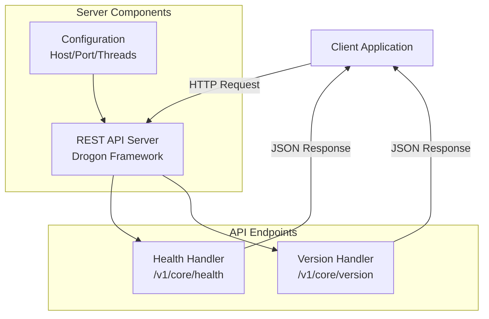
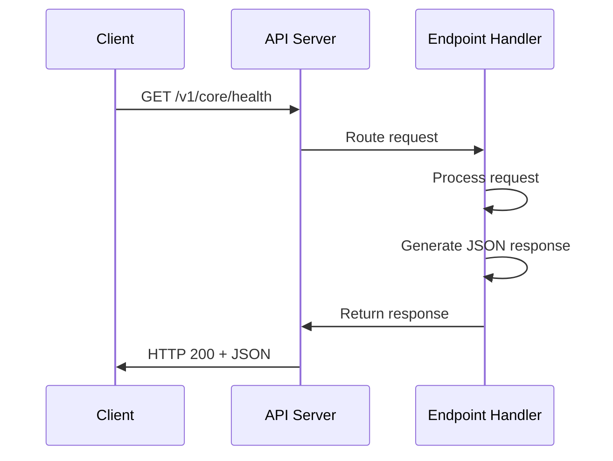
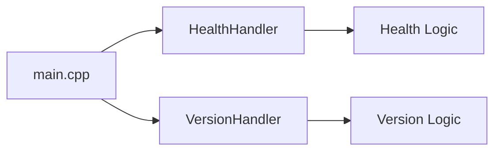
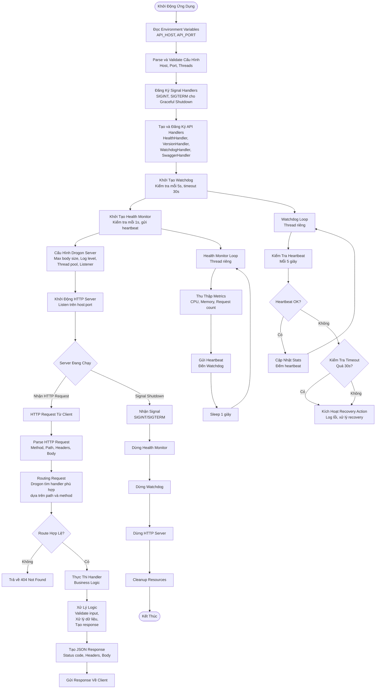
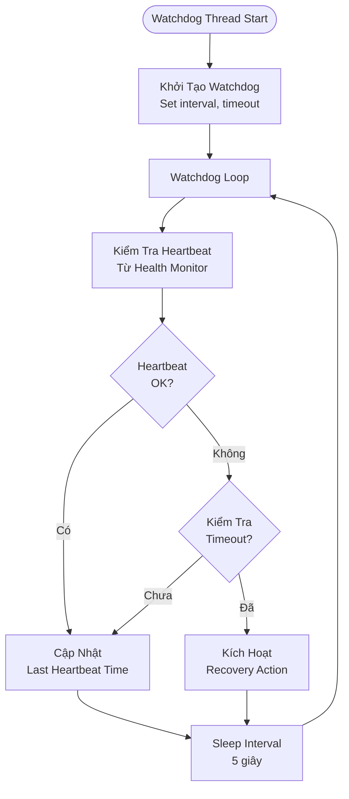
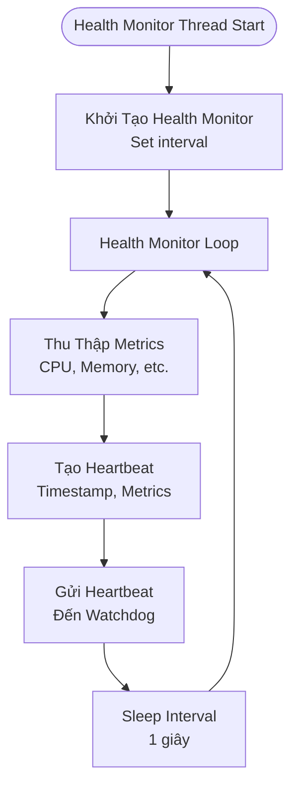
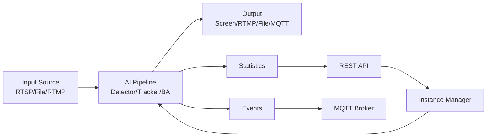

# Architecture & Flow Diagrams

Tài liệu này mô tả kiến trúc hệ thống và các flow diagram của Edge AI API.

## System Architecture



## Request Flow



## Component Structure



---

## Flow Tổng Quan Hệ Thống



## Flow Xử Lý Request Chi Tiết


## Flow Khởi Động Server


## Background Services Flow

### Watchdog Service



### Health Monitor Service



## Mô Tả Các Component

### REST API Server (Drogon Framework)

- **Chức năng**: HTTP server xử lý REST API requests
- **Port**: 8080 (mặc định), có thể cấu hình qua `API_PORT`
- **Host**: 0.0.0.0 (mặc định), có thể cấu hình qua `API_HOST`
- **Threads**: Auto-detect CPU cores, có thể cấu hình qua `THREAD_NUM`

### API Handlers

- **HealthHandler**: Health check endpoint (`/v1/core/health`)
- **VersionHandler**: Version information endpoint (`/v1/core/version`)
- **InstanceHandler**: Instance management endpoints (`/v1/core/instances/*`)
- **SolutionHandler**: Solution management endpoints (`/v1/core/solutions/*`)
- **LogsHandler**: Logs access endpoints (`/v1/core/logs/*`)

### Watchdog Service

- **Chức năng**: Giám sát health của server
- **Interval**: 5 giây (mặc định), có thể cấu hình qua `WATCHDOG_CHECK_INTERVAL_MS`
- **Timeout**: 30 giây (mặc định), có thể cấu hình qua `WATCHDOG_TIMEOUT_MS`
- **Recovery**: Tự động recovery khi phát hiện vấn đề

### Health Monitor Service

- **Chức năng**: Thu thập metrics và gửi heartbeat đến Watchdog
- **Interval**: 1 giây (mặc định), có thể cấu hình qua `HEALTH_MONITOR_INTERVAL_MS`
- **Metrics**: CPU usage, memory usage, request count, etc.

## API Endpoints Diagram

```mermaid
graph TB
    Client[Client] --> API[REST API Server]

    API --> Health[/v1/core/health]
    API --> Version[/v1/core/version]
    API --> Instances[/v1/core/instances]
    API --> Solutions[/v1/core/solutions]
    API --> Logs[/v1/core/logs]

    Instances --> Create[POST /instances]
    Instances --> List[GET /instances]
    Instances --> Get[GET /instances/:id]
    Instances --> Update[PUT /instances/:id]
    Instances --> Delete[DELETE /instances/:id]
    Instances --> Start[POST /instances/:id/start]
    Instances --> Stop[POST /instances/:id/stop]

    Solutions --> ListSolutions[GET /solutions]
    Solutions --> GetSolution[GET /solutions/:id]
    Solutions --> CreateSolution[POST /solutions]
    Solutions --> UpdateSolution[PUT /solutions/:id]
    Solutions --> DeleteSolution[DELETE /solutions/:id]
```

## Data Flow



---

## Subprocess Architecture với Unix Socket IPC

### Tổng quan

Edge AI API hỗ trợ 2 chế độ thực thi (execution mode):

1. **In-Process Mode** (Legacy): Pipeline AI chạy trong cùng process với API server
2. **Subprocess Mode** (Mới): Mỗi instance AI chạy trong worker process riêng biệt

### So sánh kiến trúc

#### In-Process Mode (Legacy)

```
┌─────────────────────────────────────────────────────┐
│                   Main Process                      │
│  ┌─────────────┐  ┌─────────────┐  ┌─────────────┐  │
│  │  REST API   │  │  Instance   │  │  Instance   │  │
│  │  Server     │  │  Pipeline A │  │  Pipeline B │  │
│  │  (Drogon)   │  │  (CVEDIX)   │  │  (CVEDIX)   │  │
│  └─────────────┘  └─────────────┘  └─────────────┘  │
│                                                     │
│  Shared Memory Space - Tất cả chạy trong 1 process  │
└─────────────────────────────────────────────────────┘
```

#### Subprocess Mode (Mới)

```
┌─────────────────────────────────────────────────────┐
│                   Main Process                      │
│  ┌─────────────┐  ┌─────────────────────────────┐   │
│  │  REST API   │  │   Worker Supervisor         │   │
│  │  Server     │◄─┤   - Spawn workers           │   │
│  │  (Drogon)   │  │   - Monitor health          │   │
│  └─────────────┘  │   - Auto-restart            │   │
│                   └─────────────────────────────┘   │
└────────────────────────────┬────────────────────────┘
                             │ Unix Socket IPC
        ┌────────────────────┼────────────────────┐
        ▼                    ▼                    ▼
┌───────────────┐   ┌───────────────┐   ┌───────────────┐
│ Worker A      │   │ Worker B      │   │ Worker C      │
│ ┌───────────┐ │   │ ┌───────────┐ │   │ ┌───────────┐ │
│ │ Pipeline  │ │   │ │ Pipeline  │ │   │ │ Pipeline  │ │
│ │ (CVEDIX)  │ │   │ │ (CVEDIX)  │ │   │ │ (CVEDIX)  │ │
│ └───────────┘ │   │ └───────────┘ │   │ └───────────┘ │
│ Isolated Mem  │   │ Isolated Mem  │   │ Isolated Mem  │
└───────────────┘   └───────────────┘   └───────────────┘
```

### So sánh ưu nhược điểm

| Tiêu chí | In-Process (Legacy) | Subprocess (Mới) |
|----------|---------------------|------------------|
| **Crash Isolation** | ❌ Crash 1 pipeline = crash toàn bộ server | ✅ Crash 1 worker không ảnh hưởng server/workers khác |
| **Memory Leak** | ❌ Leak tích lũy, phải restart server | ✅ Kill worker bị leak, spawn mới |
| **Hot Reload** | ❌ Phải restart toàn bộ server | ✅ Restart từng worker riêng lẻ |
| **Resource Limit** | ❌ Khó giới hạn CPU/RAM per instance | ✅ Có thể dùng cgroups/ulimit per worker |
| **Debugging** | ✅ Dễ debug trong 1 process | ⚠️ Phức tạp hơn (nhiều process) |
| **Latency** | ✅ Không overhead IPC | ⚠️ ~0.1-1ms overhead per IPC call |
| **Memory Usage** | ✅ Shared libraries, ít RAM hơn | ⚠️ Mỗi worker load riêng (~50-100MB/worker) |
| **Complexity** | ✅ Đơn giản | ⚠️ Phức tạp hơn (IPC, process management) |
| **Scalability** | ⚠️ Giới hạn bởi GIL-like issues | ✅ True parallelism |
| **Security** | ⚠️ Shared memory space | ✅ Process isolation |

### Chi tiết lợi ích Subprocess Mode

#### 1. Crash Isolation (Cô lập lỗi)

**Vấn đề với In-Process:**
```
Instance A crash (segfault trong GStreamer)
    → Toàn bộ server crash
    → Tất cả instances B, C, D đều dừng
    → Downtime cho toàn hệ thống
```

**Giải pháp với Subprocess:**
```
Worker A crash (segfault trong GStreamer)
    → Chỉ Worker A bị kill
    → Server vẫn chạy bình thường
    → Instances B, C, D không bị ảnh hưởng
    → WorkerSupervisor tự động spawn Worker A mới
    → Downtime chỉ cho Instance A (~2-3 giây)
```

#### 2. Memory Leak Handling

**Vấn đề với In-Process:**
- GStreamer/OpenCV có thể leak memory
- Memory tích lũy theo thời gian
- Phải restart toàn bộ server để giải phóng
- Ảnh hưởng tất cả instances

**Giải pháp với Subprocess:**
- Mỗi worker có memory space riêng
- Có thể monitor memory usage per worker
- Kill worker khi vượt ngưỡng, spawn mới
- Không ảnh hưởng workers khác

#### 3. Hot Reload

**Vấn đề với In-Process:**
- Update model → restart server
- Tất cả instances phải dừng và khởi động lại
- Downtime dài

**Giải pháp với Subprocess:**
- Update model cho Instance A → chỉ restart Worker A
- Instances B, C, D tiếp tục chạy
- Zero downtime cho hệ thống

#### 4. Resource Management

**Subprocess cho phép:**
```bash
# Giới hạn CPU per worker
taskset -c 0,1 ./edge_ai_worker ...

# Giới hạn RAM per worker
ulimit -v 2000000  # 2GB max

# Sử dụng cgroups
cgcreate -g memory,cpu:edge_ai_worker_1
cgset -r memory.limit_in_bytes=2G edge_ai_worker_1
```

### Khi nào dùng mode nào?

#### Dùng In-Process khi:
- Development/debugging
- Số lượng instances ít (1-2)
- Cần latency thấp nhất
- Resource hạn chế (embedded device nhỏ)
- Instances ổn định, ít crash

#### Dùng Subprocess khi:
- Production environment
- Nhiều instances (3+)
- Cần high availability
- Instances có thể crash/leak
- Cần hot reload
- Cần resource isolation

### Cấu hình

#### Chọn Execution Mode

```bash
# In-Process mode (default)
export EDGE_AI_EXECUTION_MODE=in-process
./edge_ai_api

# Subprocess mode
export EDGE_AI_EXECUTION_MODE=subprocess
./edge_ai_api
```

#### Cấu hình Worker

```bash
# Đường dẫn worker executable
export EDGE_AI_WORKER_PATH=/usr/bin/edge_ai_worker

# Socket directory (default: /opt/edge_ai_api/run)
export EDGE_AI_SOCKET_DIR=/opt/edge_ai_api/run

# Max restart attempts
export EDGE_AI_MAX_RESTARTS=3

# Health check interval (ms)
export EDGE_AI_HEALTH_CHECK_INTERVAL=5000
```

### IPC Protocol

Communication giữa Main Process và Workers sử dụng Unix Domain Socket với binary protocol:

```
┌──────────────────────────────────────────────────┐
│                  Message Header (16 bytes)       │
├──────────┬─────────┬──────┬──────────┬───────────┤
│  Magic   │ Version │ Type │ Reserved │ Payload   │
│  (4B)    │  (1B)   │ (1B) │   (2B)   │ Size (8B) │
├──────────┴─────────┴──────┴──────────┴───────────┤
│                  JSON Payload                    │
│              (variable length)                   │
└──────────────────────────────────────────────────┘
```

#### Message Types:
- `PING/PONG` - Health check
- `CREATE_INSTANCE` - Tạo pipeline trong worker
- `START_INSTANCE` - Bắt đầu xử lý
- `STOP_INSTANCE` - Dừng xử lý
- `GET_STATUS` - Lấy trạng thái
- `GET_STATISTICS` - Lấy thống kê
- `GET_LAST_FRAME` - Lấy frame cuối
- `SHUTDOWN` - Tắt worker

### Performance Benchmarks

| Metric | In-Process | Subprocess | Overhead |
|--------|------------|------------|----------|
| API Response (create) | 5ms | 15ms | +10ms |
| API Response (status) | 0.5ms | 1.5ms | +1ms |
| Memory per instance | ~200MB shared | ~250MB isolated | +50MB |
| Startup time | 100ms | 500ms | +400ms |
| Recovery from crash | Manual restart | Auto 2-3s | N/A |

### Kết luận

Subprocess Architecture phù hợp cho production environment với yêu cầu:
- **High Availability**: Crash isolation, auto-restart
- **Maintainability**: Hot reload, independent updates
- **Scalability**: Resource isolation, true parallelism
- **Reliability**: Memory leak handling, health monitoring

Trade-off là complexity và overhead nhỏ, nhưng lợi ích về stability và maintainability vượt trội trong môi trường production.

---

## 📚 Xem Thêm

- [DEVELOPMENT_GUIDE.md](DEVELOPMENT_GUIDE.md) - Hướng dẫn phát triển chi tiết
- [INSTANCE_GUIDE.md](INSTANCE_GUIDE.md) - Hướng dẫn sử dụng instances
- [API_REFERENCE.md](API_REFERENCE.md) - Tài liệu tham khảo API đầy đủ
