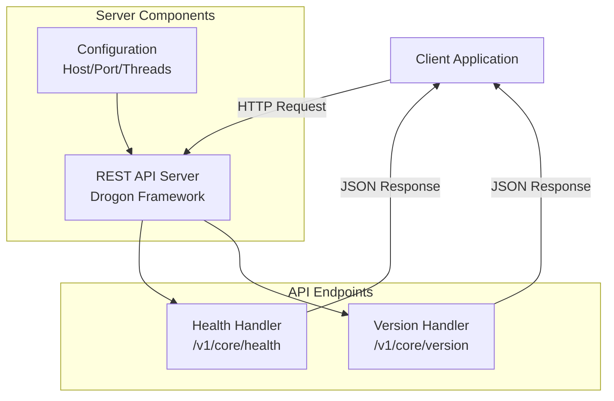
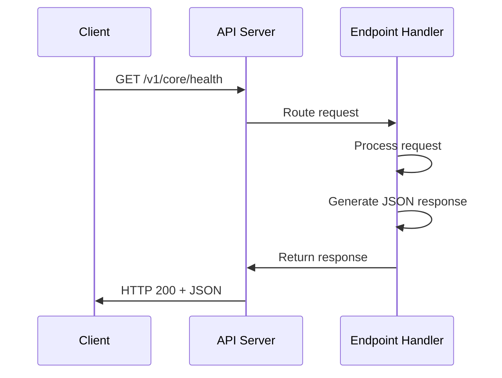
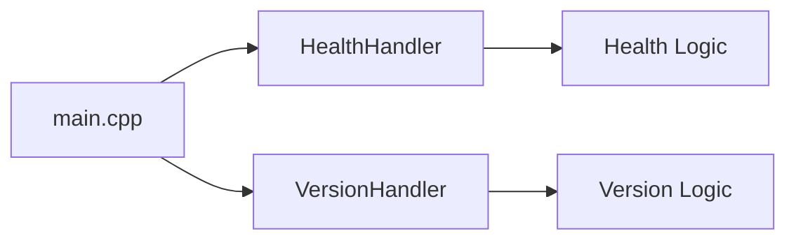
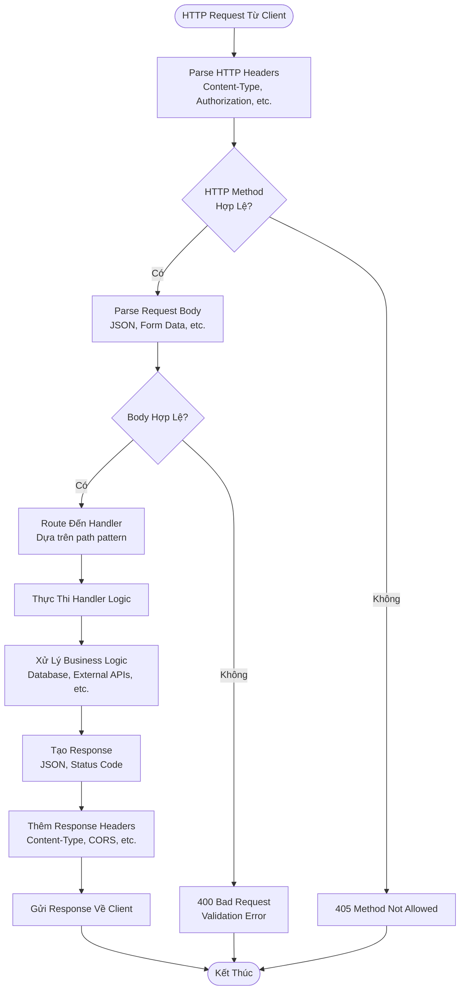
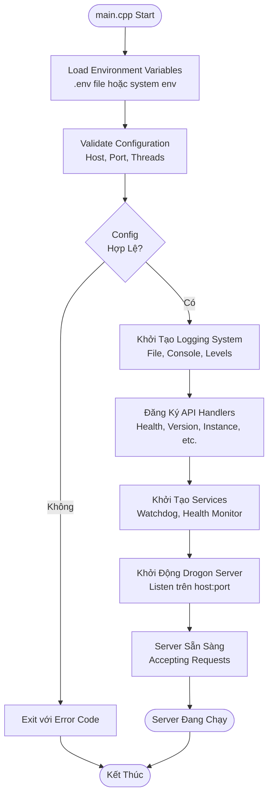
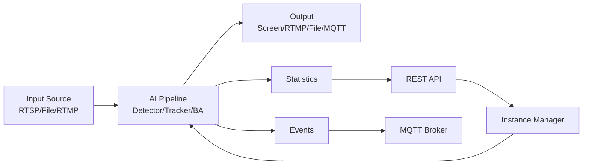

# Architecture & Flow Diagrams

Tài liệu này mô tả kiến trúc hệ thống và các flow diagram của Edge AI API.

## System Architecture



## Request Flow



## Component Structure



---

## Flow Tổng Quan Hệ Thống


## Flow Xử Lý Request Chi Tiết



## Flow Khởi Động Server



## Background Services Flow

### Watchdog Service


### Health Monitor Service


## Mô Tả Các Component

### REST API Server (Drogon Framework)

- **Chức năng**: HTTP server xử lý REST API requests
- **Port**: 8080 (mặc định), có thể cấu hình qua `API_PORT`
- **Host**: 0.0.0.0 (mặc định), có thể cấu hình qua `API_HOST`
- **Threads**: Auto-detect CPU cores, có thể cấu hình qua `THREAD_NUM`

### API Handlers

- **HealthHandler**: Health check endpoint (`/v1/core/health`)
- **VersionHandler**: Version information endpoint (`/v1/core/version`)
- **InstanceHandler**: Instance management endpoints (`/v1/core/instances/*`)
- **SolutionHandler**: Solution management endpoints (`/v1/core/solutions/*`)
- **LogsHandler**: Logs access endpoints (`/v1/core/logs/*`)

### Watchdog Service

- **Chức năng**: Giám sát health của server
- **Interval**: 5 giây (mặc định), có thể cấu hình qua `WATCHDOG_CHECK_INTERVAL_MS`
- **Timeout**: 30 giây (mặc định), có thể cấu hình qua `WATCHDOG_TIMEOUT_MS`
- **Recovery**: Tự động recovery khi phát hiện vấn đề

### Health Monitor Service

- **Chức năng**: Thu thập metrics và gửi heartbeat đến Watchdog
- **Interval**: 1 giây (mặc định), có thể cấu hình qua `HEALTH_MONITOR_INTERVAL_MS`
- **Metrics**: CPU usage, memory usage, request count, etc.

## API Endpoints Diagram

```mermaid
graph TB
    Client[Client] --> API[REST API Server]
    
    API --> Health[/v1/core/health]
    API --> Version[/v1/core/version]
    API --> Instances[/v1/core/instances]
    API --> Solutions[/v1/core/solutions]
    API --> Logs[/v1/core/logs]
    
    Instances --> Create[POST /instances]
    Instances --> List[GET /instances]
    Instances --> Get[GET /instances/:id]
    Instances --> Update[PUT /instances/:id]
    Instances --> Delete[DELETE /instances/:id]
    Instances --> Start[POST /instances/:id/start]
    Instances --> Stop[POST /instances/:id/stop]
    
    Solutions --> ListSolutions[GET /solutions]
    Solutions --> GetSolution[GET /solutions/:id]
    Solutions --> CreateSolution[POST /solutions]
    Solutions --> UpdateSolution[PUT /solutions/:id]
    Solutions --> DeleteSolution[DELETE /solutions/:id]
```

## Data Flow



---

## 📚 Xem Thêm

- [DEVELOPMENT_GUIDE.md](DEVELOPMENT_GUIDE.md) - Hướng dẫn phát triển chi tiết
- [INSTANCE_GUIDE.md](INSTANCE_GUIDE.md) - Hướng dẫn sử dụng instances
- [API_REFERENCE.md](API_REFERENCE.md) - Tài liệu tham khảo API đầy đủ

