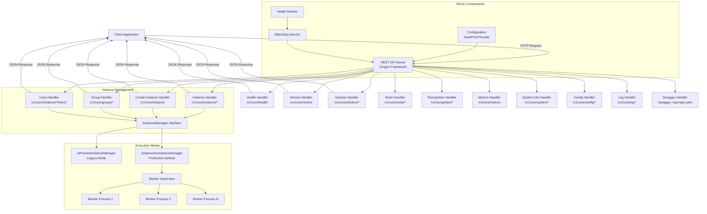
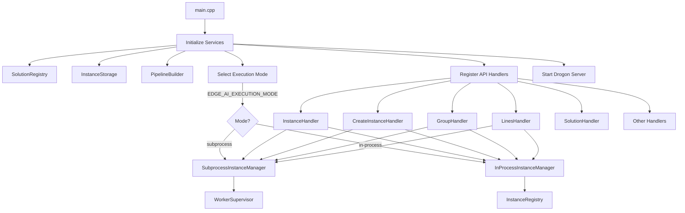
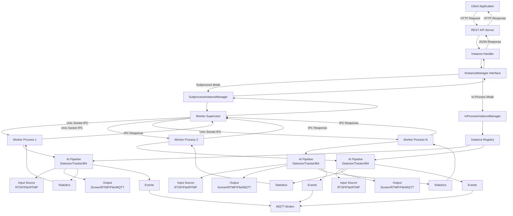
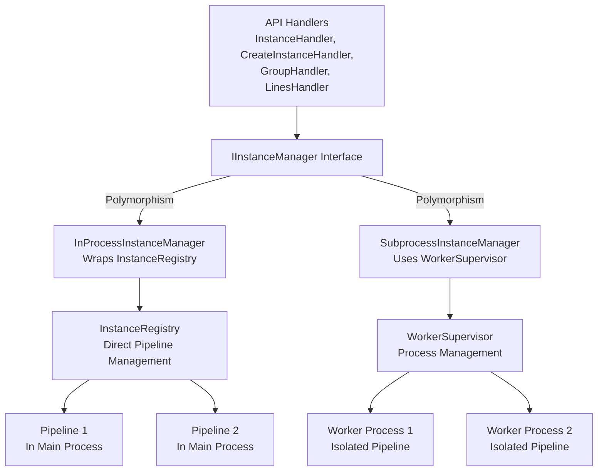

```mermaid
flowchart TD
    Start([Watchdog Thread Start]) --> Init[Khởi Tạo Watchdog<br/>Set interval, timeout]
    Init --> Loop[Watchdog Loop]
    Loop --> CheckHeartbeat[Kiểm Tra Heartbeat<br/>Từ Health Monitor]
    CheckHeartbeat --> HeartbeatOK{Heartbeat<br/>OK?}
    HeartbeatOK -->|Có| UpdateLastHeartbeat[Cập Nhật<br/>Last Heartbeat Time]
    HeartbeatOK -->|Không| CheckTimeout{Kiểm Tra<br/>Timeout?}
    CheckTimeout -->|Chưa| UpdateLastHeartbeat
    CheckTimeout -->|Đã| TriggerRecovery[Kích Hoạt<br/>Recovery Action]
    UpdateLastHeartbeat --> Sleep[Sleep Interval<br/>5 giây]
    TriggerRecovery --> Sleep
    Sleep --> Loop
```

# Architecture & Flow Diagrams

Tài liệu này mô tả kiến trúc hệ thống và các flow diagram của Edge AI API.

## System Architecture



## Request Flow


## Component Structure



---

## Flow Tổng Quan Hệ Thống

```mermaid
flowchart TD
    Start([Khởi Động Ứng Dụng]) --> ReadEnv[Đọc Environment Variables<br/>API_HOST, API_PORT]
    ReadEnv --> ParseConfig[Parse và Validate Cấu Hình<br/>Host, Port, Threads]
    ParseConfig --> RegisterSignal[Đăng Ký Signal Handlers<br/>SIGINT, SIGTERM cho Graceful Shutdown]
    RegisterSignal --> CreateHandlers[Tạo và Đăng Ký API Handlers<br/>HealthHandler, VersionHandler,<br/>WatchdogHandler, SwaggerHandler]
    CreateHandlers --> InitWatchdog[Khởi Tạo Watchdog<br/>Kiểm tra mỗi 5s, timeout 30s]
    InitWatchdog --> InitHealthMonitor[Khởi Tạo Health Monitor<br/>Kiểm tra mỗi 1s, gửi heartbeat]
    InitHealthMonitor --> ConfigDrogon[Cấu Hình Drogon Server<br/>Max body size, Log level,<br/>Thread pool, Listener]
    ConfigDrogon --> StartServer[Khởi Động HTTP Server<br/>Listen trên host:port]
    StartServer --> Running{Server Đang Chạy}

    Running -->|Nhận HTTP Request| ReceiveRequest[HTTP Request Từ Client]
    ReceiveRequest --> ParseRequest[Parse HTTP Request<br/>Method, Path, Headers, Body]
    ParseRequest --> RouteRequest[Routing Request<br/>Drogon tìm handler phù hợp<br/>dựa trên path và method]
    RouteRequest --> ValidateRoute{Route Hợp Lệ?}
    ValidateRoute -->|Không| Return404[Trả về 404 Not Found]
    ValidateRoute -->|Có| ExecuteHandler[Thực Thi Handler<br/>Business Logic]
    ExecuteHandler --> ProcessLogic[Xử Lý Logic<br/>Validate input,<br/>Xử lý dữ liệu,<br/>Tạo response]
    ProcessLogic --> BuildResponse[Tạo JSON Response<br/>Status code, Headers, Body]
    BuildResponse --> SendResponse[Gửi Response Về Client]

    Running -->|Signal Shutdown| ShutdownSignal[Nhận Signal<br/>SIGINT/SIGTERM]
    ShutdownSignal --> StopHealthMonitor[Dừng Health Monitor]
    StopHealthMonitor --> StopWatchdog[Dừng Watchdog]
    StopWatchdog --> StopServer[Dừng HTTP Server]
    StopServer --> Cleanup[Cleanup Resources]
    Cleanup --> End([Kết Thúc])

    InitWatchdog --> WatchdogLoop[Watchdog Loop<br/>Thread riêng]
    WatchdogLoop --> CheckHeartbeat[Kiểm Tra Heartbeat<br/>Mỗi 5 giây]
    CheckHeartbeat --> HeartbeatOK{Heartbeat OK?}
    HeartbeatOK -->|Có| UpdateStats[Cập Nhật Stats<br/>Đếm heartbeat]
    HeartbeatOK -->|Không| CheckTimeout{Kiểm Tra Timeout<br/>Quá 30s?}
    CheckTimeout -->|Có| TriggerRecovery[Kích Hoạt Recovery Action<br/>Log lỗi, xử lý recovery]
    CheckTimeout -->|Không| TriggerRecovery
    UpdateStats --> WatchdogLoop

    InitHealthMonitor --> HealthMonitorLoop[Health Monitor Loop<br/>Thread riêng]
    HealthMonitorLoop --> CollectMetrics[Thu Thập Metrics<br/>CPU, Memory, Request count]
    CollectMetrics --> SendHeartbeat[Gửi Heartbeat<br/>Đến Watchdog]
    SendHeartbeat --> SleepMonitor[Sleep 1 giây]
    SleepMonitor --> HealthMonitorLoop
```



## Flow Xử Lý Request Chi Tiết

```mermaid
flowchart TD
    Start([HTTP Request Từ Client]) --> ParseHeaders[Parse HTTP Headers<br/>Content-Type, Authorization, etc.]
    ParseHeaders --> ValidateMethod{HTTP Method<br/>Hợp Lệ?}
    ValidateMethod -->|Không| Return405[405 Method Not Allowed]
    ValidateMethod -->|Có| ParseBody[Parse Request Body<br/>JSON, Form Data, etc.]
    ParseBody --> ValidateBody{Body Hợp Lệ?}
    ValidateBody -->|Không| Return400[400 Bad Request<br/>Validation Error]
    ValidateBody -->|Có| RouteToHandler[Route Đến Handler<br/>Dựa trên path pattern]
    RouteToHandler --> ExecuteHandler[Thực Thi Handler Logic]
    ExecuteHandler --> ProcessBusinessLogic[Xử Lý Business Logic<br/>Database, External APIs, etc.]
    ProcessBusinessLogic --> GenerateResponse[Tạo Response<br/>JSON, Status Code]
    GenerateResponse --> AddHeaders[Thêm Response Headers<br/>Content-Type, CORS, etc.]
    AddHeaders --> SendResponse[Gửi Response Về Client]
    SendResponse --> End([Kết Thúc])

    Return400 --> End
    Return405 --> End
```



## Flow Khởi Động Server

```mermaid
flowchart TD
    Start([main.cpp Start]) --> LoadEnv[Load Environment Variables<br/>.env file hoặc system env]
    LoadEnv --> ValidateConfig[Validate Configuration<br/>Host, Port, Threads]
    ValidateConfig --> ConfigInvalid{Config<br/>Hợp Lệ?}
    ConfigInvalid -->|Không| ExitError[Exit với Error Code]
    ConfigInvalid -->|Có| InitLogging[Khởi Tạo Logging System<br/>File, Console, Levels]
    InitLogging --> InitCoreServices[Khởi Tạo Core Services<br/>SolutionRegistry, InstanceStorage,<br/>PipelineBuilder]
    InitCoreServices --> CheckExecutionMode[Kiểm Tra EDGE_AI_EXECUTION_MODE<br/>Environment Variable]
    CheckExecutionMode --> ModeDecision{Execution Mode?}
    ModeDecision -->|subprocess| CreateSubprocessManager[Tạo SubprocessInstanceManager<br/>+ WorkerSupervisor]
    ModeDecision -->|in-process| CreateInProcessManager[Tạo InProcessInstanceManager<br/>+ InstanceRegistry]
    ModeDecision -->|not set| DefaultInProcess[Default: In-Process Mode<br/>Backward Compatibility]
    DefaultInProcess --> CreateInProcessManager
    CreateSubprocessManager --> SetInstanceManager[Set IInstanceManager<br/>cho các Handlers]
    CreateInProcessManager --> SetInstanceManager
    SetInstanceManager --> RegisterHandlers[Đăng Ký API Handlers<br/>InstanceHandler, CreateInstanceHandler,<br/>GroupHandler, LinesHandler, etc.]
    RegisterHandlers --> InitServices[Khởi Tạo Services<br/>Watchdog, Health Monitor]
    InitServices --> LoadPersistentInstances[Load Persistent Instances<br/>từ InstanceStorage]
    LoadPersistentInstances --> StartDrogon[Khởi Động Drogon Server<br/>Listen trên host:port]
    StartDrogon --> ServerReady[Server Sẵn Sàng<br/>Accepting Requests]
    ServerReady --> Running([Server Đang Chạy])

    ExitError --> End([Kết Thúc])
    Running --> End
```



## Background Services Flow

### Watchdog Service



### Health Monitor Service



```mermaid
flowchart TD
    Start([Health Monitor Thread Start]) --> Init[Khởi Tạo Health Monitor<br/>Set interval]
    Init --> Loop[Health Monitor Loop]
    Loop --> CollectMetrics[Thu Thập Metrics<br/>CPU, Memory, etc.]
    CollectMetrics --> CreateHeartbeat[Tạo Heartbeat<br/>Timestamp, Metrics]
    CreateHeartbeat --> SendHeartbeat[Gửi Heartbeat<br/>Đến Watchdog]
    SendHeartbeat --> Sleep[Sleep Interval<br/>1 giây]
    Sleep --> Loop
```

## Mô Tả Các Component

### REST API Server (Drogon Framework)

- **Chức năng**: HTTP server xử lý REST API requests
- **Port**: 8080 (mặc định), có thể cấu hình qua `API_PORT`
- **Host**: 0.0.0.0 (mặc định), có thể cấu hình qua `API_HOST`
- **Threads**: Auto-detect CPU cores, có thể cấu hình qua `THREAD_NUM`

### API Handlers

Tất cả API handlers sử dụng **IInstanceManager interface**, cho phép hoạt động với cả In-Process và Subprocess mode:

- **HealthHandler**: Health check endpoint (`/v1/core/health`)
- **VersionHandler**: Version information endpoint (`/v1/core/version`)
- **InstanceHandler**: Instance management endpoints (`/v1/core/instance/*`)
- **CreateInstanceHandler**: Create instance endpoint (`/v1/core/instance`)
- **SolutionHandler**: Solution management endpoints (`/v1/core/solution/*`)
- **GroupHandler**: Group management endpoints (`/v1/core/groups/*`)
- **LinesHandler**: Crossing lines management endpoints (`/v1/core/instance/{id}/lines/*`)
- **NodeHandler**: Node management endpoints (`/v1/core/node/*`)
- **RecognitionHandler**: Face recognition endpoints (`/v1/recognition/*`)
- **MetricsHandler**: Metrics endpoint (`/v1/core/metrics`)
- **SystemInfoHandler**: System information endpoints (`/v1/core/system/*`)
- **ConfigHandler**: Configuration endpoints (`/v1/core/config/*`)
- **LogHandler**: Logs access endpoints (`/v1/core/log/*`)
- **SwaggerHandler**: API documentation endpoints (`/swagger`, `/openapi.yaml`)

### Watchdog Service

- **Chức năng**: Giám sát health của server
- **Interval**: 5 giây (mặc định), có thể cấu hình qua `WATCHDOG_CHECK_INTERVAL_MS`
- **Timeout**: 30 giây (mặc định), có thể cấu hình qua `WATCHDOG_TIMEOUT_MS`
- **Recovery**: Tự động recovery khi phát hiện vấn đề

### Health Monitor Service

- **Chức năng**: Thu thập metrics và gửi heartbeat đến Watchdog
- **Interval**: 1 giây (mặc định), có thể cấu hình qua `HEALTH_MONITOR_INTERVAL_MS`
- **Metrics**: CPU usage, memory usage, request count, etc.

## API Endpoints Diagram

```mermaid
graph TB
    Client[Client] --> API[REST API Server]

    API --> Health[/v1/core/health]
    API --> Version[/v1/core/version]
    API --> Instances[/v1/core/instance]
    API --> CreateInstance[POST /v1/core/instance]
    API --> Solutions[/v1/core/solution]
    API --> Groups[/v1/core/groups]
    API --> Lines[/v1/core/instance/:id/lines]
    API --> Nodes[/v1/core/node]
    API --> Recognition[/v1/recognition]
    API --> Metrics[/v1/core/metrics]
    API --> SystemInfo[/v1/core/system]
    API --> Config[/v1/core/config]
    API --> Logs[/v1/core/log]
    API --> Swagger[/swagger, /openapi.yaml]

    Instances --> List[GET /instances]
    Instances --> Get[GET /instances/:id]
    Instances --> Update[PUT /instances/:id]
    Instances --> Delete[DELETE /instances/:id]
    Instances --> Start[POST /instances/:id/start]
    Instances --> Stop[POST /instances/:id/stop]
    Instances --> Restart[POST /instances/:id/restart]
    Instances --> BatchOps[POST /instances/batch/*]
    Instances --> ConfigOps[GET/POST /instances/:id/config]
    Instances --> Stats[GET /instances/:id/statistics]

    Lines --> ListLines[GET /instances/:id/lines]
    Lines --> GetLine[GET /instances/:id/lines/:lineId]
    Lines --> CreateLine[POST /instances/:id/lines]
    Lines --> UpdateLine[PUT /instances/:id/lines/:lineId]
    Lines --> DeleteLine[DELETE /instances/:id/lines/:lineId]
    Lines --> DeleteAllLines[DELETE /instances/:id/lines]

    Solutions --> ListSolutions[GET /solutions]
    Solutions --> GetSolution[GET /solutions/:id]
    Solutions --> CreateSolution[POST /solutions]
    Solutions --> UpdateSolution[PUT /solutions/:id]
    Solutions --> DeleteSolution[DELETE /solutions/:id]

    Groups --> ListGroups[GET /groups]
    Groups --> GetGroup[GET /groups/:id]
    Groups --> CreateGroup[POST /groups]
    Groups --> UpdateGroup[PUT /groups/:id]
    Groups --> DeleteGroup[DELETE /groups/:id]
    Groups --> GetGroupInstances[GET /groups/:id/instances]
```

## Data Flow



---

## Subprocess Architecture với Unix Socket IPC

### Tổng quan

Edge AI API hỗ trợ 2 chế độ thực thi (execution mode):

1. **In-Process Mode** (Legacy): Pipeline AI chạy trong cùng process với API server
2. **Subprocess Mode** (Production Default): Mỗi instance AI chạy trong worker process riêng biệt

**Lưu ý**: Khi build và cài đặt từ .deb package, production mặc định sử dụng **Subprocess Mode** để đảm bảo high availability, crash isolation, và hot reload capability.

### So sánh kiến trúc

#### In-Process Mode (Legacy)

```
┌─────────────────────────────────────────────────────┐
│                   Main Process                      │
│  ┌─────────────┐  ┌─────────────┐  ┌─────────────┐  │
│  │  REST API   │  │  Instance   │  │  Instance   │  │
│  │  Server     │  │  Pipeline A │  │  Pipeline B │  │
│  │  (Drogon)   │  │  (CVEDIX)   │  │  (CVEDIX)   │  │
│  └─────────────┘  └─────────────┘  └─────────────┘  │
│                                                     │
│  Shared Memory Space - Tất cả chạy trong 1 process  │
└─────────────────────────────────────────────────────┘
```

#### Subprocess Mode (Mới)

```
┌─────────────────────────────────────────────────────┐
│                   Main Process                      │
│  ┌─────────────┐  ┌─────────────────────────────┐   │
│  │  REST API   │  │   Worker Supervisor         │   │
│  │  Server     │◄─┤   - Spawn workers           │   │
│  │  (Drogon)   │  │   - Monitor health          │   │
│  └─────────────┘  │   - Auto-restart            │   │
│                   └─────────────────────────────┘   │
└────────────────────────────┬────────────────────────┘
                             │ Unix Socket IPC
        ┌────────────────────┼────────────────────┐
        ▼                    ▼                    ▼
┌───────────────┐   ┌───────────────┐   ┌───────────────┐
│ Worker A      │   │ Worker B      │   │ Worker C      │
│ ┌───────────┐ │   │ ┌───────────┐ │   │ ┌───────────┐ │
│ │ Pipeline  │ │   │ │ Pipeline  │ │   │ │ Pipeline  │ │
│ │ (CVEDIX)  │ │   │ │ (CVEDIX)  │ │   │ │ (CVEDIX)  │ │
│ └───────────┘ │   │ └───────────┘ │   │ └───────────┘ │
│ Isolated Mem  │   │ Isolated Mem  │   │ Isolated Mem  │
└───────────────┘   └───────────────┘   └───────────────┘
```

### So sánh ưu nhược điểm

| Tiêu chí | In-Process (Legacy) | Subprocess (Mới) |
|----------|---------------------|------------------|
| **Crash Isolation** | ❌ Crash 1 pipeline = crash toàn bộ server | ✅ Crash 1 worker không ảnh hưởng server/workers khác |
| **Memory Leak** | ❌ Leak tích lũy, phải restart server | ✅ Kill worker bị leak, spawn mới |
| **Hot Reload** | ❌ Phải restart toàn bộ server | ✅ Restart từng worker riêng lẻ |
| **Resource Limit** | ❌ Khó giới hạn CPU/RAM per instance | ✅ Có thể dùng cgroups/ulimit per worker |
| **Debugging** | ✅ Dễ debug trong 1 process | ⚠️ Phức tạp hơn (nhiều process) |
| **Latency** | ✅ Không overhead IPC | ⚠️ ~0.1-1ms overhead per IPC call |
| **Memory Usage** | ✅ Shared libraries, ít RAM hơn | ⚠️ Mỗi worker load riêng (~50-100MB/worker) |
| **Complexity** | ✅ Đơn giản | ⚠️ Phức tạp hơn (IPC, process management) |
| **Scalability** | ⚠️ Giới hạn bởi GIL-like issues | ✅ True parallelism |
| **Security** | ⚠️ Shared memory space | ✅ Process isolation |

### Chi tiết lợi ích Subprocess Mode

#### 1. Crash Isolation (Cô lập lỗi)

**Vấn đề với In-Process:**
```
Instance A crash (segfault trong GStreamer)
    → Toàn bộ server crash
    → Tất cả instances B, C, D đều dừng
    → Downtime cho toàn hệ thống
```

**Giải pháp với Subprocess:**
```
Worker A crash (segfault trong GStreamer)
    → Chỉ Worker A bị kill
    → Server vẫn chạy bình thường
    → Instances B, C, D không bị ảnh hưởng
    → WorkerSupervisor tự động spawn Worker A mới
    → Downtime chỉ cho Instance A (~2-3 giây)
```

#### 2. Memory Leak Handling

**Vấn đề với In-Process:**
- GStreamer/OpenCV có thể leak memory
- Memory tích lũy theo thời gian
- Phải restart toàn bộ server để giải phóng
- Ảnh hưởng tất cả instances

**Giải pháp với Subprocess:**
- Mỗi worker có memory space riêng
- Có thể monitor memory usage per worker
- Kill worker khi vượt ngưỡng, spawn mới
- Không ảnh hưởng workers khác

#### 3. Hot Reload

**Vấn đề với In-Process:**
- Update model → restart server
- Tất cả instances phải dừng và khởi động lại
- Downtime dài

**Giải pháp với Subprocess:**
- Update model cho Instance A → chỉ restart Worker A
- Instances B, C, D tiếp tục chạy
- Zero downtime cho hệ thống

#### 4. Resource Management

**Subprocess cho phép:**
```bash
# Giới hạn CPU per worker
taskset -c 0,1 ./edge_ai_worker ...

# Giới hạn RAM per worker
ulimit -v 2000000  # 2GB max

# Sử dụng cgroups
cgcreate -g memory,cpu:edge_ai_worker_1
cgset -r memory.limit_in_bytes=2G edge_ai_worker_1
```

### Khi nào dùng mode nào?

#### Dùng In-Process khi:
- Development/debugging
- Số lượng instances ít (1-2)
- Cần latency thấp nhất
- Resource hạn chế (embedded device nhỏ)
- Instances ổn định, ít crash

#### Dùng Subprocess khi:
- Production environment
- Nhiều instances (3+)
- Cần high availability
- Instances có thể crash/leak
- Cần hot reload
- Cần resource isolation

### Cấu hình

#### Chọn Execution Mode

```bash
# In-Process mode (legacy, for development)
export EDGE_AI_EXECUTION_MODE=in-process
./edge_ai_api

# Subprocess mode (production default)
export EDGE_AI_EXECUTION_MODE=subprocess
./edge_ai_api
```

**Production Configuration**: Khi cài đặt từ .deb package, file `/opt/edge_ai_api/config/.env` được tạo tự động với `EDGE_AI_EXECUTION_MODE=subprocess`. Systemd service sẽ load file này, đảm bảo production chạy Subprocess mode mặc định.

Để chuyển về In-Process mode trong production, sửa file `/opt/edge_ai_api/config/.env`:
```bash
sudo nano /opt/edge_ai_api/config/.env
# Thay đổi: EDGE_AI_EXECUTION_MODE=in-process
sudo systemctl restart edge-ai-api
```

#### Cấu hình Worker

```bash
# Đường dẫn worker executable
export EDGE_AI_WORKER_PATH=/usr/bin/edge_ai_worker

# Socket directory (default: /opt/edge_ai_api/run)
export EDGE_AI_SOCKET_DIR=/opt/edge_ai_api/run

# Max restart attempts
export EDGE_AI_MAX_RESTARTS=3

# Health check interval (ms)
export EDGE_AI_HEALTH_CHECK_INTERVAL=5000
```

### IPC Protocol

Communication giữa Main Process và Workers sử dụng Unix Domain Socket với binary protocol:

```
┌──────────────────────────────────────────────────┐
│                  Message Header (16 bytes)       │
├──────────┬─────────┬──────┬──────────┬───────────┤
│  Magic   │ Version │ Type │ Reserved │ Payload   │
│  (4B)    │  (1B)   │ (1B) │   (2B)   │ Size (8B) │
├──────────┴─────────┴──────┴──────────┴───────────┤
│                  JSON Payload                    │
│              (variable length)                   │
└──────────────────────────────────────────────────┘
```

#### Message Types:
- `PING/PONG` - Health check
- `CREATE_INSTANCE` - Tạo pipeline trong worker
- `START_INSTANCE` - Bắt đầu xử lý
- `STOP_INSTANCE` - Dừng xử lý
- `GET_STATUS` - Lấy trạng thái
- `GET_STATISTICS` - Lấy thống kê
- `GET_LAST_FRAME` - Lấy frame cuối
- `SHUTDOWN` - Tắt worker

### Performance Benchmarks

| Metric | In-Process | Subprocess | Overhead |
|--------|------------|------------|----------|
| API Response (create) | 5ms | 15ms | +10ms |
| API Response (status) | 0.5ms | 1.5ms | +1ms |
| Memory per instance | ~200MB shared | ~250MB isolated | +50MB |
| Startup time | 100ms | 500ms | +400ms |
| Recovery from crash | Manual restart | Auto 2-3s | N/A |

### Kết luận

Subprocess Architecture phù hợp cho production environment với yêu cầu:
- **High Availability**: Crash isolation, auto-restart
- **Maintainability**: Hot reload, independent updates
- **Scalability**: Resource isolation, true parallelism
- **Reliability**: Memory leak handling, health monitoring

Trade-off là complexity và overhead nhỏ (~10ms per API call, ~50MB RAM per worker), nhưng lợi ích về stability và maintainability vượt trội trong môi trường production.

### Instance Manager Interface

Tất cả API handlers sử dụng `IInstanceManager` interface, cho phép abstraction layer giữa handlers và execution backend:



**Lợi ích của Interface Pattern**:
- Handlers không cần biết execution mode
- Dễ dàng switch giữa modes
- Code reuse và maintainability
- Test dễ dàng với mock implementations

**Production Setup**: Khi cài đặt từ .deb package:
- `edge_ai_worker` executable được install vào `/usr/local/bin`
- File `/opt/edge_ai_api/config/.env` được tạo với `EDGE_AI_EXECUTION_MODE=subprocess`
- Systemd service load `.env` file → production chạy Subprocess mode mặc định

---

## 📚 Xem Thêm

- [DEVELOPMENT_GUIDE.md](DEVELOPMENT_GUIDE.md) - Hướng dẫn phát triển chi tiết
- [INSTANCE_GUIDE.md](INSTANCE_GUIDE.md) - Hướng dẫn sử dụng instances
- [API_REFERENCE.md](API_REFERENCE.md) - Tài liệu tham khảo API đầy đủ
