```mermaid
flowchart TD
    Start([Watchdog Thread Start]) --> Init[Khởi Tạo Watchdog<br/>Set interval, timeout]
    Init --> Loop[Watchdog Loop]
    Loop --> CheckHeartbeat[Kiểm Tra Heartbeat<br/>Từ Health Monitor]
    CheckHeartbeat --> HeartbeatOK{Heartbeat<br/>OK?}
    HeartbeatOK -->|Có| UpdateLastHeartbeat[Cập Nhật<br/>Last Heartbeat Time]
    HeartbeatOK -->|Không| CheckTimeout{Kiểm Tra<br/>Timeout?}
    CheckTimeout -->|Chưa| UpdateLastHeartbeat
    CheckTimeout -->|Đã| TriggerRecovery[Kích Hoạt<br/>Recovery Action]
    UpdateLastHeartbeat --> Sleep[Sleep Interval<br/>5 giây]
    TriggerRecovery --> Sleep
    Sleep --> Loop
```

# Architecture & Flow Diagrams

Tài liệu này mô tả kiến trúc hệ thống và các flow diagram của Edge AI API.

## System Architecture


## Request Flow


## Component Structure


---

## Flow Tổng Quan Hệ Thống

```mermaid
flowchart TD
    Start([Khởi Động Ứng Dụng]) --> ReadEnv[Đọc Environment Variables<br/>API_HOST, API_PORT]
    ReadEnv --> ParseConfig[Parse và Validate Cấu Hình<br/>Host, Port, Threads]
    ParseConfig --> RegisterSignal[Đăng Ký Signal Handlers<br/>SIGINT, SIGTERM cho Graceful Shutdown]
    RegisterSignal --> CreateHandlers[Tạo và Đăng Ký API Handlers<br/>HealthHandler, VersionHandler,<br/>WatchdogHandler, SwaggerHandler]
    CreateHandlers --> InitWatchdog[Khởi Tạo Watchdog<br/>Kiểm tra mỗi 5s, timeout 30s]
    InitWatchdog --> InitHealthMonitor[Khởi Tạo Health Monitor<br/>Kiểm tra mỗi 1s, gửi heartbeat]
    InitHealthMonitor --> ConfigDrogon[Cấu Hình Drogon Server<br/>Max body size, Log level,<br/>Thread pool, Listener]
    ConfigDrogon --> StartServer[Khởi Động HTTP Server<br/>Listen trên host:port]
    StartServer --> Running{Server Đang Chạy}
    
    Running -->|Nhận HTTP Request| ReceiveRequest[HTTP Request Từ Client]
    ReceiveRequest --> ParseRequest[Parse HTTP Request<br/>Method, Path, Headers, Body]
    ParseRequest --> RouteRequest[Routing Request<br/>Drogon tìm handler phù hợp<br/>dựa trên path và method]
    RouteRequest --> ValidateRoute{Route Hợp Lệ?}
    ValidateRoute -->|Không| Return404[Trả về 404 Not Found]
    ValidateRoute -->|Có| ExecuteHandler[Thực Thi Handler<br/>Business Logic]
    ExecuteHandler --> ProcessLogic[Xử Lý Logic<br/>Validate input,<br/>Xử lý dữ liệu,<br/>Tạo response]
    ProcessLogic --> BuildResponse[Tạo JSON Response<br/>Status code, Headers, Body]
    BuildResponse --> SendResponse[Gửi Response Về Client]
    
    Running -->|Signal Shutdown| ShutdownSignal[Nhận Signal<br/>SIGINT/SIGTERM]
    ShutdownSignal --> StopHealthMonitor[Dừng Health Monitor]
    StopHealthMonitor --> StopWatchdog[Dừng Watchdog]
    StopWatchdog --> StopServer[Dừng HTTP Server]
    StopServer --> Cleanup[Cleanup Resources]
    Cleanup --> End([Kết Thúc])
    
    InitWatchdog --> WatchdogLoop[Watchdog Loop<br/>Thread riêng]
    WatchdogLoop --> CheckHeartbeat[Kiểm Tra Heartbeat<br/>Mỗi 5 giây]
    CheckHeartbeat --> HeartbeatOK{Heartbeat OK?}
    HeartbeatOK -->|Có| UpdateStats[Cập Nhật Stats<br/>Đếm heartbeat]
    HeartbeatOK -->|Không| CheckTimeout{Kiểm Tra Timeout<br/>Quá 30s?}
    CheckTimeout -->|Có| TriggerRecovery[Kích Hoạt Recovery Action<br/>Log lỗi, xử lý recovery]
    CheckTimeout -->|Không| TriggerRecovery
    UpdateStats --> WatchdogLoop
    
    InitHealthMonitor --> HealthMonitorLoop[Health Monitor Loop<br/>Thread riêng]
    HealthMonitorLoop --> CollectMetrics[Thu Thập Metrics<br/>CPU, Memory, Request count]
    CollectMetrics --> SendHeartbeat[Gửi Heartbeat<br/>Đến Watchdog]
    SendHeartbeat --> SleepMonitor[Sleep 1 giây]
    SleepMonitor --> HealthMonitorLoop
```



## Flow Xử Lý Request Chi Tiết

```mermaid
flowchart TD
    Start([HTTP Request Từ Client]) --> ParseHeaders[Parse HTTP Headers<br/>Content-Type, Authorization, etc.]
    ParseHeaders --> ValidateMethod{HTTP Method<br/>Hợp Lệ?}
    ValidateMethod -->|Không| Return405[405 Method Not Allowed]
    ValidateMethod -->|Có| ParseBody[Parse Request Body<br/>JSON, Form Data, etc.]
    ParseBody --> ValidateBody{Body Hợp Lệ?}
    ValidateBody -->|Không| Return400[400 Bad Request<br/>Validation Error]
    ValidateBody -->|Có| RouteToHandler[Route Đến Handler<br/>Dựa trên path pattern]
    RouteToHandler --> ExecuteHandler[Thực Thi Handler Logic]
    ExecuteHandler --> ProcessBusinessLogic[Xử Lý Business Logic<br/>Database, External APIs, etc.]
    ProcessBusinessLogic --> GenerateResponse[Tạo Response<br/>JSON, Status Code]
    GenerateResponse --> AddHeaders[Thêm Response Headers<br/>Content-Type, CORS, etc.]
    AddHeaders --> SendResponse[Gửi Response Về Client]
    SendResponse --> End([Kết Thúc])
    
    Return400 --> End
    Return405 --> End
```



## Flow Khởi Động Server

```mermaid
flowchart TD
    Start([main.cpp Start]) --> LoadEnv[Load Environment Variables<br/>.env file hoặc system env]
    LoadEnv --> ValidateConfig[Validate Configuration<br/>Host, Port, Threads]
    ValidateConfig --> ConfigInvalid{Config<br/>Hợp Lệ?}
    ConfigInvalid -->|Không| ExitError[Exit với Error Code]
    ConfigInvalid -->|Có| InitLogging[Khởi Tạo Logging System<br/>File, Console, Levels]
    InitLogging --> RegisterHandlers[Đăng Ký API Handlers<br/>Health, Version, Instance, etc.]
    RegisterHandlers --> InitServices[Khởi Tạo Services<br/>Watchdog, Health Monitor]
    InitServices --> StartDrogon[Khởi Động Drogon Server<br/>Listen trên host:port]
    StartDrogon --> ServerReady[Server Sẵn Sàng<br/>Accepting Requests]
    ServerReady --> Running([Server Đang Chạy])
    
    ExitError --> End([Kết Thúc])
    Running --> End
```



## Background Services Flow

### Watchdog Service



### Health Monitor Service



```mermaid
flowchart TD
    Start([Health Monitor Thread Start]) --> Init[Khởi Tạo Health Monitor<br/>Set interval]
    Init --> Loop[Health Monitor Loop]
    Loop --> CollectMetrics[Thu Thập Metrics<br/>CPU, Memory, etc.]
    CollectMetrics --> CreateHeartbeat[Tạo Heartbeat<br/>Timestamp, Metrics]
    CreateHeartbeat --> SendHeartbeat[Gửi Heartbeat<br/>Đến Watchdog]
    SendHeartbeat --> Sleep[Sleep Interval<br/>1 giây]
    Sleep --> Loop
```

## Mô Tả Các Component

### REST API Server (Drogon Framework)

- **Chức năng**: HTTP server xử lý REST API requests
- **Port**: 8080 (mặc định), có thể cấu hình qua `API_PORT`
- **Host**: 0.0.0.0 (mặc định), có thể cấu hình qua `API_HOST`
- **Threads**: Auto-detect CPU cores, có thể cấu hình qua `THREAD_NUM`

### API Handlers

- **HealthHandler**: Health check endpoint (`/v1/core/health`)
- **VersionHandler**: Version information endpoint (`/v1/core/version`)
- **InstanceHandler**: Instance management endpoints (`/v1/core/instances/*`)
- **SolutionHandler**: Solution management endpoints (`/v1/core/solutions/*`)
- **LogsHandler**: Logs access endpoints (`/v1/core/logs/*`)

### Watchdog Service

- **Chức năng**: Giám sát health của server
- **Interval**: 5 giây (mặc định), có thể cấu hình qua `WATCHDOG_CHECK_INTERVAL_MS`
- **Timeout**: 30 giây (mặc định), có thể cấu hình qua `WATCHDOG_TIMEOUT_MS`
- **Recovery**: Tự động recovery khi phát hiện vấn đề

### Health Monitor Service

- **Chức năng**: Thu thập metrics và gửi heartbeat đến Watchdog
- **Interval**: 1 giây (mặc định), có thể cấu hình qua `HEALTH_MONITOR_INTERVAL_MS`
- **Metrics**: CPU usage, memory usage, request count, etc.

## API Endpoints Diagram

```mermaid
graph TB
    Client[Client] --> API[REST API Server]
    
    API --> Health[/v1/core/health]
    API --> Version[/v1/core/version]
    API --> Instances[/v1/core/instances]
    API --> Solutions[/v1/core/solutions]
    API --> Logs[/v1/core/logs]
    
    Instances --> Create[POST /instances]
    Instances --> List[GET /instances]
    Instances --> Get[GET /instances/:id]
    Instances --> Update[PUT /instances/:id]
    Instances --> Delete[DELETE /instances/:id]
    Instances --> Start[POST /instances/:id/start]
    Instances --> Stop[POST /instances/:id/stop]
    
    Solutions --> ListSolutions[GET /solutions]
    Solutions --> GetSolution[GET /solutions/:id]
    Solutions --> CreateSolution[POST /solutions]
    Solutions --> UpdateSolution[PUT /solutions/:id]
    Solutions --> DeleteSolution[DELETE /solutions/:id]
```

## Data Flow


---

## 📚 Xem Thêm

- [DEVELOPMENT_GUIDE.md](DEVELOPMENT_GUIDE.md) - Hướng dẫn phát triển chi tiết
- [INSTANCE_GUIDE.md](INSTANCE_GUIDE.md) - Hướng dẫn sử dụng instances
- [API_REFERENCE.md](API_REFERENCE.md) - Tài liệu tham khảo API đầy đủ

