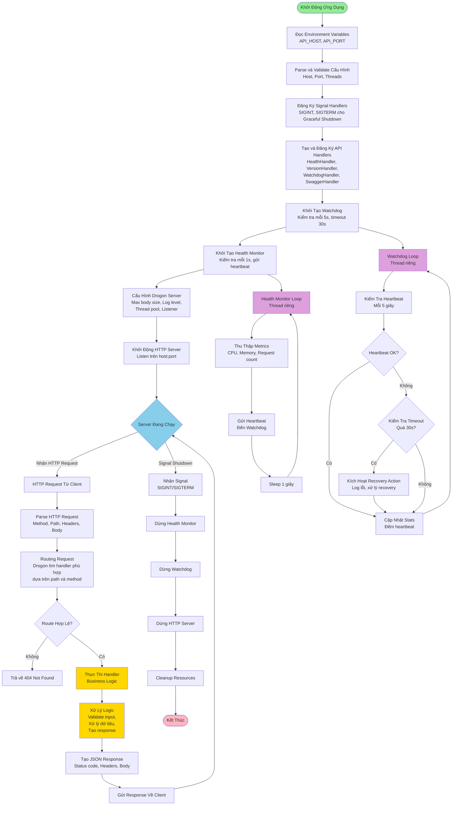
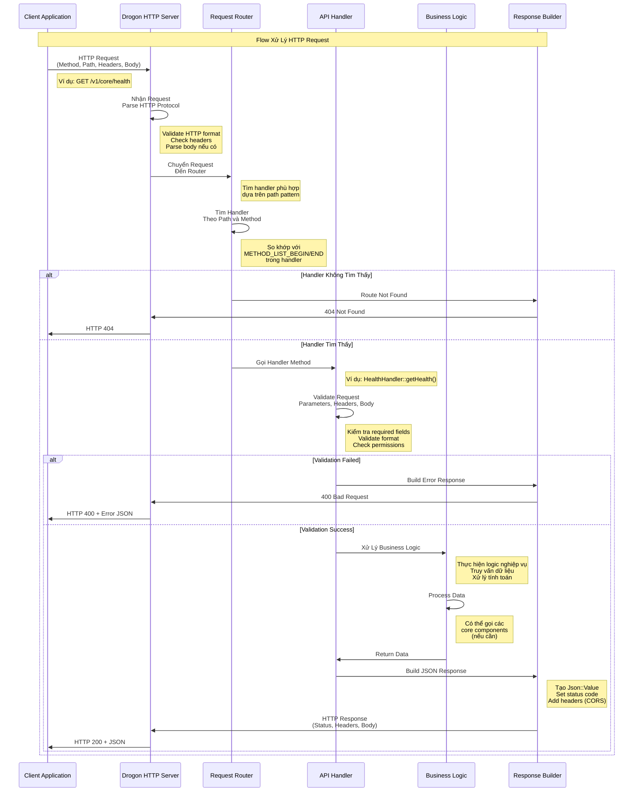
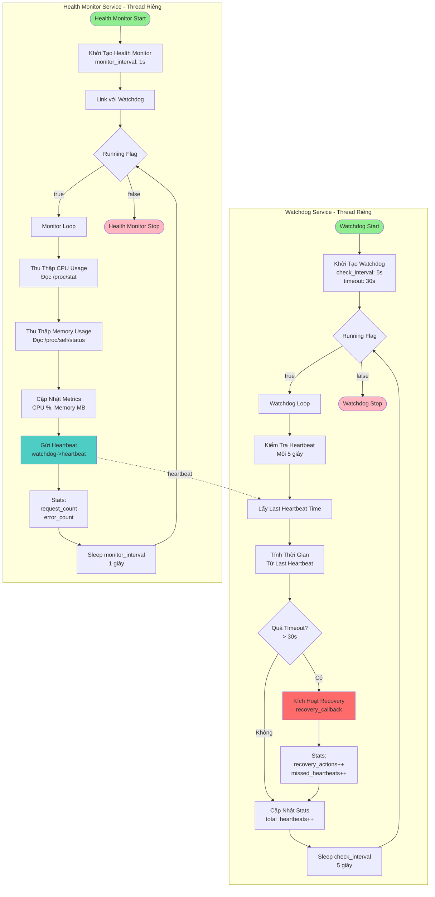

# Flow Diagram - Edge AI API

Diagram tổng quan về flow xử lý của Edge AI API project.

## Flow Tổng Quan Hệ Thống

## Flow Xử Lý Request Chi Tiết

## Flow Khởi Động Server

```mermaid
flowchart TD
    Start([main.cpp - Khởi Động]) --> Init[Khởi Tạo Ứng Dụng]
    
    Init --> ReadEnv[Đọc Environment Variables]
    ReadEnv -->|API_HOST| CheckHost{Có API_HOST?}
    CheckHost -->|Có| UseHost[Sử dụng API_HOST]
    CheckHost -->|Không| DefaultHost[Default: 0.0.0.0]
    UseHost --> ParsePort
    DefaultHost --> ParsePort[Parse API_PORT]
    
    ParsePort -->|API_PORT| CheckPort{Có API_PORT?}
    CheckPort -->|Có| ValidatePort[Validate Port<br/>1-65535]
    CheckPort -->|Không| DefaultPort[Default: 8080]
    ValidatePort -->|Invalid| DefaultPort
    ValidatePort -->|Valid| UsePort[Sử dụng Port]
    DefaultPort --> UsePort
    
    UsePort --> RegisterSignal[Đăng Ký Signal Handlers]
    RegisterSignal -->|SIGINT| SignalHandler[signalHandler<br/>Graceful Shutdown]
    RegisterSignal -->|SIGTERM| SignalHandler
    
    SignalHandler --> CreateHandlers[Tạo Handler Instances]
    CreateHandlers --> HealthHandler[HealthHandler<br/>GET /v1/core/health]
    CreateHandlers --> VersionHandler[VersionHandler<br/>GET /v1/core/version]
    CreateHandlers --> WatchdogHandler[WatchdogHandler<br/>GET /v1/core/watchdog]
    CreateHandlers --> SwaggerHandler[SwaggerHandler<br/>GET /swagger, /openapi.yaml]
    
    HealthHandler --> AutoRegister[Drogon Auto-Register<br/>Handlers]
    VersionHandler --> AutoRegister
    WatchdogHandler --> AutoRegister
    SwaggerHandler --> AutoRegister
    
    AutoRegister --> InitWatchdog[Khởi Tạo Watchdog]
    InitWatchdog -->|check_interval: 5000ms| WatchdogConfig[Watchdog Config<br/>timeout: 30000ms]
    WatchdogConfig --> StartWatchdog[Start Watchdog Thread<br/>watchdogLoop]
    
    StartWatchdog --> InitHealthMonitor[Khởi Tạo Health Monitor]
    InitHealthMonitor -->|monitor_interval: 1000ms| HealthMonitorConfig[Health Monitor Config]
    HealthMonitorConfig --> StartHealthMonitor[Start Health Monitor Thread<br/>monitorLoop]
    StartHealthMonitor --> LinkWatchdog[Link Health Monitor<br/>với Watchdog]
    
    LinkWatchdog --> ConfigDrogon[Cấu Hình Drogon]
    ConfigDrogon --> SetBodySize[setClientMaxBodySize<br/>1MB]
    SetBodySize --> SetLogLevel[setLogLevel<br/>kInfo]
    SetLogLevel --> AddListener[addListener<br/>host:port]
    AddListener --> SetThreads[setThreadNum<br/>hardware_concurrency]
    
    SetThreads --> RunServer[run - Khởi Động Server]
    RunServer --> Listening[Server Đang Lắng Nghe<br/>Sẵn Sàng Nhận Request]
    
    Listening -->|Nhận Request| ProcessRequest[Xử Lý Request]
    Listening -->|Nhận Signal| Shutdown[Graceful Shutdown]
    
    Shutdown --> StopHealthMonitor[Dừng Health Monitor]
    StopHealthMonitor --> StopWatchdog[Dừng Watchdog]
    StopWatchdog --> Cleanup[Cleanup Resources]
    Cleanup --> Exit([Thoát])
    
    style Start fill:#90EE90
    style Listening fill:#87CEEB
    style Exit fill:#FFB6C1
    style ProcessRequest fill:#FFD700
    style StartWatchdog fill:#DDA0DD
    style StartHealthMonitor fill:#DDA0DD
```

## Background Services Flow

## Mô Tả Các Component

### 1. Khởi Động Ứng Dụng
- **Đọc Environment Variables**: Đọc `API_HOST` và `API_PORT` từ môi trường
- **Parse và Validate Cấu Hình**: Kiểm tra và validate host, port (1-65535)
- **Đăng Ký Signal Handlers**: Xử lý SIGINT/SIGTERM để graceful shutdown
- **Tạo và Đăng Ký API Handlers**: Tạo instances của các handlers, Drogon tự động đăng ký
- **Khởi Tạo Watchdog**: Tạo Watchdog với interval 5s, timeout 30s
- **Khởi Tạo Health Monitor**: Tạo Health Monitor với interval 1s, link với Watchdog
- **Cấu Hình Drogon Server**: Set max body size, log level, thread pool, listener
- **Khởi Động HTTP Server**: Server bắt đầu lắng nghe trên host:port

### 2. Xử Lý HTTP Request
- **Nhận HTTP Request**: Drogon nhận request từ client
- **Parse HTTP Request**: Parse method, path, headers, body
- **Routing Request**: Drogon router tìm handler phù hợp dựa trên path pattern
- **Validate Route**: Kiểm tra route có tồn tại không
- **Thực Thi Handler**: Gọi method tương ứng trong handler
- **Xử Lý Logic**: Validate input, xử lý business logic, tạo response
- **Tạo JSON Response**: Build Json::Value, set status code, add headers
- **Gửi Response**: Trả về HTTP response cho client

### 3. Watchdog Service
- **Mục đích**: Giám sát ứng dụng, phát hiện khi ứng dụng không phản hồi
- **Cơ chế**: Chạy trên thread riêng, kiểm tra heartbeat mỗi 5 giây
- **Timeout**: Nếu không nhận heartbeat trong 30 giây, kích hoạt recovery
- **Recovery Action**: Gọi callback để xử lý khi phát hiện lỗi
- **Stats**: Đếm total heartbeats, missed heartbeats, recovery actions

### 4. Health Monitor Service
- **Mục đích**: Thu thập metrics về hệ thống và gửi heartbeat
- **Cơ chế**: Chạy trên thread riêng, thu thập metrics mỗi 1 giây
- **Metrics**: CPU usage, memory usage, request count, error count
- **Heartbeat**: Gửi heartbeat đến Watchdog để báo hiệu ứng dụng còn sống
- **Integration**: Liên kết với Watchdog để đảm bảo ứng dụng hoạt động bình thường

## Lưu Ý

1. **Thread Safety**: Watchdog và Health Monitor chạy trên threads riêng, sử dụng atomic flags và mutex để đảm bảo thread safety
2. **Graceful Shutdown**: Khi nhận signal, server sẽ dừng nhận request mới, xử lý request đang chạy, sau đó cleanup resources
3. **Auto Registration**: Drogon tự động đăng ký handlers khi tạo instance, không cần đăng ký thủ công
4. **Error Handling**: Mọi handler đều có try-catch để xử lý exception và trả về error response phù hợp
5. **CORS Headers**: Các response đều có CORS headers để hỗ trợ cross-origin requests

