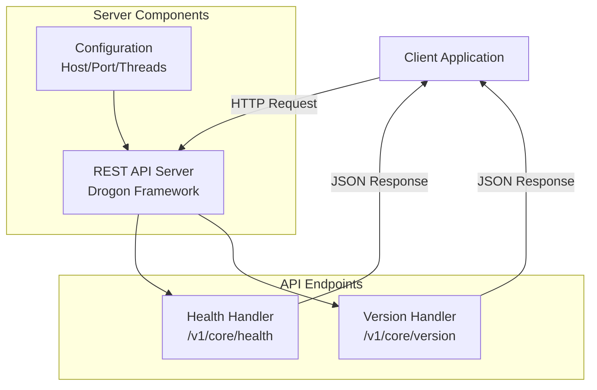
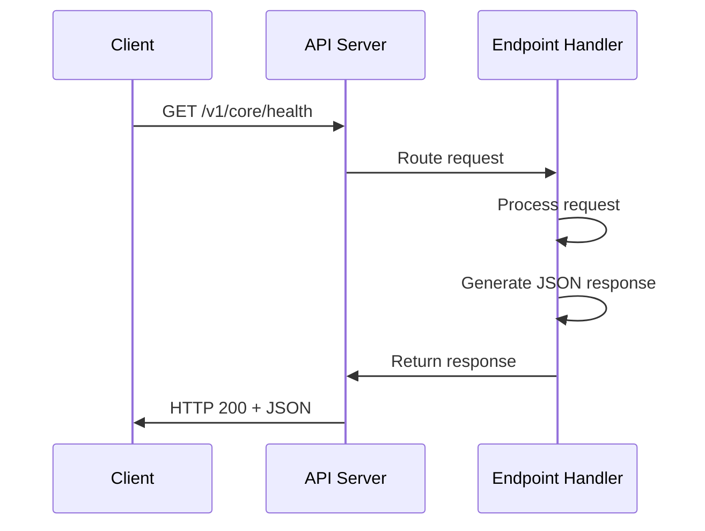
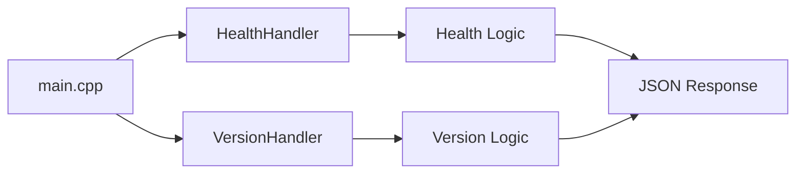

# Edge AI REST API - Architecture Diagram

## System Architecture



## Request Flow



## Component Structure



## API Endpoints

```mermaid
graph TD
    API[Edge AI API<br/>:8080] --> Health[/v1/core/health<br/>GET]
    API --> Version[/v1/core/version<br/>GET]
    
    Health --> HealthResp{Response}
    HealthResp -->|200 OK| HealthJSON[JSON:<br/>status, timestamp, uptime]
    
    Version --> VersionResp{Response}
    VersionResp -->|200 OK| VersionJSON[JSON:<br/>version, build_time, git_commit]
```

